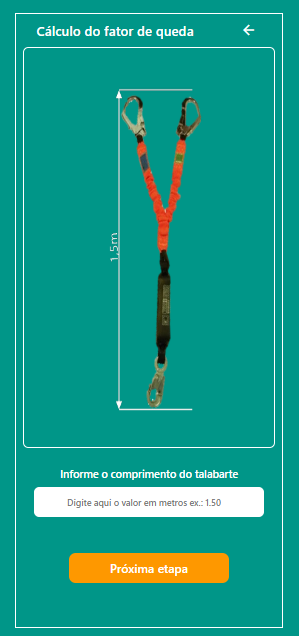
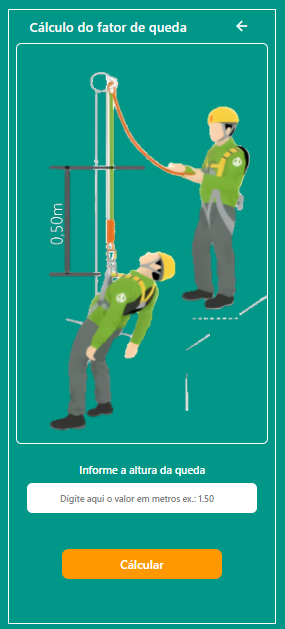
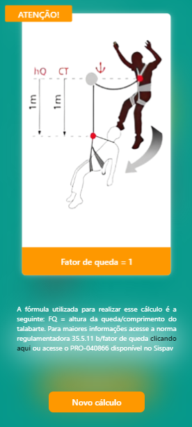
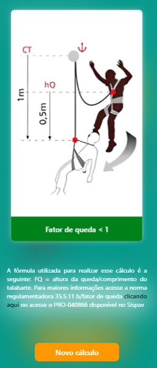
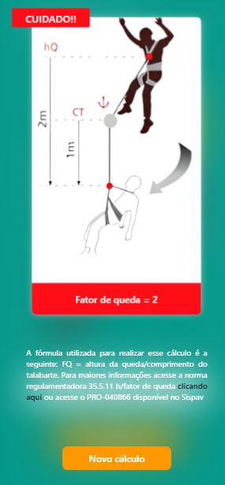

## Fall Factor Calculator
This is a simple application that calculates the fall factor based on the length of the lanyard and the height of the fall, developed in HTML, CSS, and JavaScript.

**Features**
Enter the length of the lanyard.



Enter the height of the fall.



Calculate the fall factor.

View the result with important information.

<p float="left">
  
  
  
</p>

**Prerequisites**

Before getting started, make sure you have a web browser to run the application.

**Installation and Usage**

Clone the repository to your local machine:

   ```bash
   https://github.com/paulob3j/CalculadoraFatorQueda-HTML-CSS-JS.git
